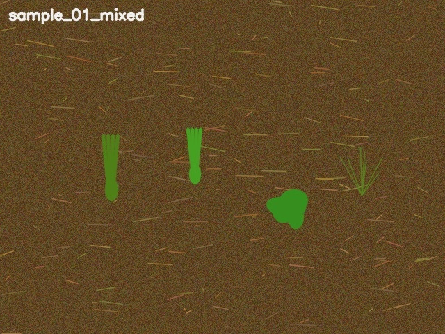

# Reproducible smoke-test artifact

Generated: 2026-09-23

This directory contains one actual software smoke-test output. It is **not a
field experiment, benchmark result, or evidence of crop–weed detection
accuracy**.

Command:

```bash
python scripts/make_sample_images.py --out-dir <temporary-input>
python main.py detect \
  --source <temporary-input>/sample_01_mixed.jpg \
  --save-dir <temporary-output> \
  --device cpu \
  --imgsz 320
```

Environment: Python 3.14, CPU inference, COCO-pretrained `yolov8s.pt`.

Result: the model produced zero detections, which is expected because the
synthetic shapes and the project's target classes are outside the COCO model's
training objective. The screenshot proves only that image loading, inference,
visualisation, and JSON output completed successfully.



The matching structured output is stored in
[`smoke_test_predictions.json`](smoke_test_predictions.json).
Its temporary absolute input path was normalized to `<temporary-input>` before
commit so the artifact does not expose a machine-specific directory.
