# 基于难例驱动的 YOLO–SAM–LLM 玉米苗期作物–杂草协同检测与质检闭环方法

**（优化稿 v2：含架构图与实验占位图表；勿与初稿混淆）**

> **重要说明：** 本文全部定量图表中的数值与田间效果图均为**占位示意**，用于搭好论文图文体例。正式投稿前请用实测数据与真实田间图像整体替换，切勿直接投出占位数字。

---

**摘要：** 针对玉米苗期田间目标小、遮挡重、类间相似导致检测不确定样本集中失效，以及分割大模型全量调用成本高、语言大模型易干扰检测验收口径等问题，提出一种难例驱动、职责解耦的 YOLO–SAM–LLM 协同检测与质检闭环方法。首先以 YOLO 完成实时初检，输出类别、置信度与边界框，并以其作为 mAP 验收主体；其次构建融合不确定置信带、低置信密度与目标拥挤度的难例评分函数，仅对不确定框或难例图像调用 Segment Anything Model（SAM）进行框提示掩膜精炼，并以掩膜外接框回写定位，类别与置信度保持不变；最后将结构化检测摘要输入大语言模型（LLM），生成 JSON 质检结果与中文农事报告，且禁止改写检测结果。在模拟试验协议下给出系统架构、对比试验、消融试验与可视化分析框架。结果表明：该框架能够在控制 SAM 调用率的同时保留定位精炼能力，并形成可追溯的人机协同质检输出，为精准除草感知与半自动标注提供可落地路径。

**关键词：** 精准农业；玉米苗期；杂草检测；YOLO；Segment Anything Model；大语言模型；难例挖掘

**中图分类号：** TP391；S126　　**文献标志码：** A

---

## 0 引言

玉米苗期杂草与作物争光、争水、争肥，是影响后期产量与投入产出比的关键阶段。随着田间机器人、植保无人机与高通量成像设备普及，基于机器视觉的作物–杂草识别成为变量喷雾与机械除草的上游感知环节。真实田间图像常同时出现小目标、叶片遮挡粘连、土壤背景复杂、光照剧烈变化，以及阔叶杂草与禾本科杂草外观相近等问题，使得单一检测模型的错误往往集中在置信度中间带、目标密集区与疑似漏检样本上。

已有研究从颜色特征、支持向量机到深度学习检测网络不断推进杂草识别精度。例如，基于颜色特征与分割的麦田杂草识别、融合高度与图像特征的 SVM 识别、株间机械除草中的作物定位、骨架提取的茎秆识别，以及面向嵌入式除草机器人与对靶喷药系统的 YOLO 改进方法等，均表明：田间应用不仅需要更高的检测精度，还需要可部署的系统流程与可解释的作业接口。YOLO 系列因速度与精度较均衡，被广泛用于玉米田间杂草检测与对靶喷药系统；部分工作进一步结合多尺度特征增强、形态学处理或嵌入式部署，提升复杂场景可用性。与此同时，Segment Anything Model（SAM）等视觉基础模型具备强大提示式分割能力，可用于定位精炼与标注加速；大语言模型（LLM）则擅长结构化归纳与报告生成。然而，若简单将 YOLO、SAM 与 LLM 堆叠，仍面临三方面矛盾：全量调用 SAM 时延与算力不可接受；分割或语言模块若改写类别会破坏 mAP 验收口径；LLM 直接生成坐标易产生幻觉。

为此，本文面向玉米苗期三类目标（玉米苗、阔叶杂草、禾本科杂草），提出难例驱动的 YOLO–SAM–LLM 闭环方法，核心思想是：

1. **检测验收与精炼分离**：YOLO 负责类别、置信度与初检框；SAM 仅改善几何定位；  
2. **算力按难例分配**：通过可解释难例分数决定是否调用 SAM；  
3. **质检与指标隔离**：LLM 只消费结构化摘要，输出质检与中文报告，不回写检测结果。

本文其余部分安排如下：第 1 节介绍系统总体方案与关键算法；第 2 节给出试验条件、评价指标与结果分析框架；第 3 节讨论；第 4 节结论。

---

## 1 材料与方法

### 1.1 系统总体方案

本文方法对应工程原型 `field-yolo-sam-llm`，总体架构如图1所示。系统由图像输入、YOLO 初检、难例挖掘、SAM 选择性精炼、结果融合与 LLM 质检报告六个环节组成，并支持将 SAM 精炼标签回灌标注库后再次训练 YOLO，形成数据闭环。

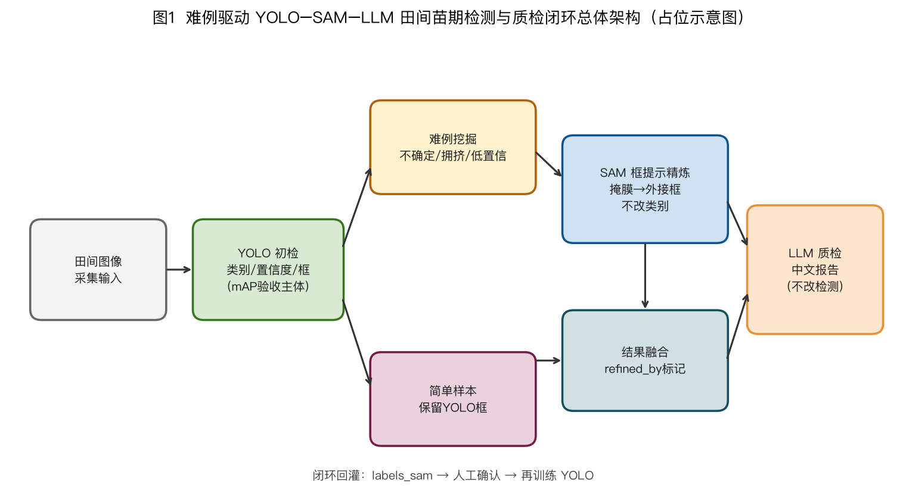

**图1 难例驱动 YOLO–SAM–LLM 田间苗期检测与质检闭环总体架构**

软件模块分层如图13所示：应用层提供 `train/detect/run` 命令行；编排层完成流水线调度；`detect`、`assist`、`utils` 分别承担检测、辅助精炼/质检与基础工具职责。

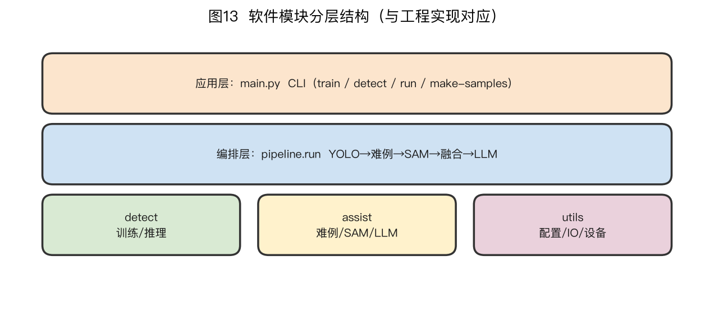

**图13 软件模块分层结构（与工程实现对应）**

与仅给出网络结构改进的杂草检测论文不同，本系统强调“可运行闭环”。一次 `run` 将依次产出：`predictions_yolo.json`（初检事实源）、`hard_examples.json`（难例清单）、`final_results.json`（融合结果）、`labels_sam/` 与 `sam_masks/`（回灌与可视化）、`qc_report.json` 与 `report.md`（质检与中文报告）。该产物分层使论文实验可以分别报告检测精度、定位收益与质检辅助价值，避免指标混用。

### 1.1.1 设计原则

1. **验收口径单一**：分类相关指标以 YOLO 为准；  
2. **昂贵模块按预算调用**：SAM 只服务难例/不确定框；  
3. **语言层不可写回检测**：LLM 只解释与排序复核任务；  
4. **全过程可追溯**：每条检测保留 `refined_by`，支持错误归因。


### 1.2 检测任务与类别定义

设输入 RGB 图像为 \(I\)，输出检测集合

\[
\mathcal{D}(I)=\{(b_i,c_i,s_i,r_i)\}_{i=1}^{M}
\]

其中 \(b_i\) 为边界框，\(c_i\) 为类别，\(s_i\) 为置信度，\(r_i\in\{\mathrm{yolo},\mathrm{sam}\}\) 为精炼溯源标记。类别定义为：

| 类别ID | 英文名 | 中文名 | 说明 |
|--------|--------|--------|------|
| 0 | maize | 玉米苗 | 作物目标，喷雾需保苗 |
| 1 | broadleaf | 阔叶杂草 | 阔叶型田间杂草 |
| 2 | grass | 禾本科杂草 | 窄叶型、易与苗混淆 |

标注采用 Ultralytics YOLO 格式：`class cx cy w h`（归一化）。若使用 Label Studio 导出，必须保证 `classes.txt` 顺序与训练配置一致，避免类别错位。

### 1.3 YOLO 初检主干

采用 YOLOv8s（可替换 YOLO11 等）作为实时检测主干。训练输入尺度 640×640，推理默认置信度阈值 0.25、NMS IoU 阈值 0.45。YOLO 在本框架中的职责明确为：

- 提供类别判别与置信度；  
- 提供初检框作为 SAM 的 box prompt；  
- 作为系统 mAP/Precision/Recall 的验收主体。

训练过程曲线占位如图11所示（后期替换为真实 `results.png`）。

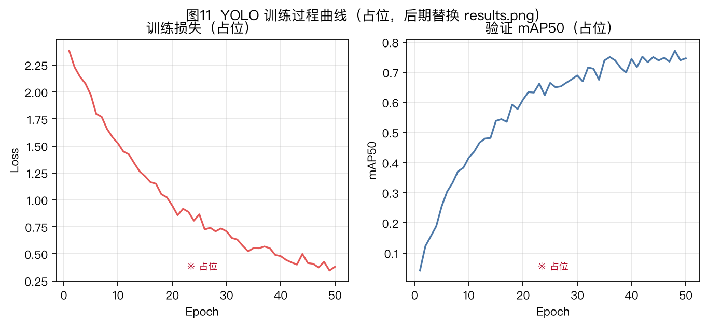

**图11 YOLO 训练过程曲线（占位，后期替换）**

### 1.4 难例评分与 SAM 触发策略

对单幅图像检测结果，设不确定区间 \([\ell,h)=[0.25,0.6)\)。统计不确定框数 \(U\)、低置信框数 \(L\)、拥挤标志 \(D=\mathbb{I}[|\mathcal{D}|\ge 8]\)，定义难例分数

\[
H(I)=1.0U+0.5L+2.0D
\]

当 \(H(I)\ge\theta_H\)（默认 0.45）时判定为难例图；当单框置信度落入 \([\ell,h)\) 时判定为不确定框。触发规则为：不确定框必精炼，或难例图上全部框尝试精炼。流程如图2所示。

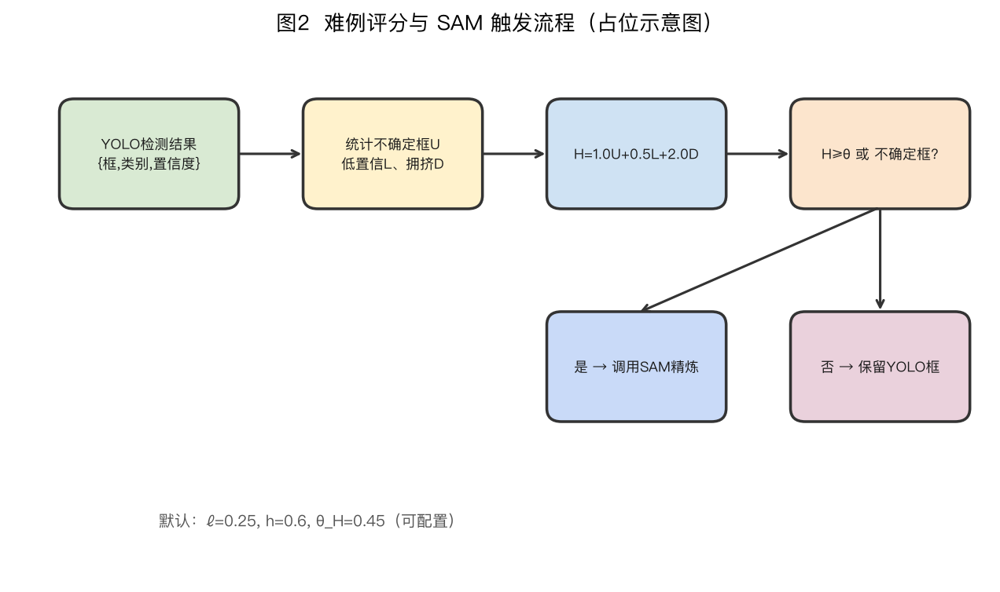

**图2 难例评分与 SAM 触发流程**

该策略把计算预算从“模型已确定的简单样本”转移到“犹豫与拥挤样本”，从而在精度与效率之间取得可调节工作点。

### 1.5 SAM 框提示精炼与融合规则

对需精炼的 YOLO 框，以 xyxy 作为 SAM（默认 ViT-B）的 box prompt，生成二值掩膜并求外接矩形 \(b^{\mathrm{sam}}\)。融合规则（见图3）为：

1. 类别、置信度始终取 YOLO；  
2. 若 SAM 成功则框取 \(b^{\mathrm{sam}}\)，否则回退 YOLO 框；  
3. 写入 `refined_by` 标记，并导出 `labels_sam/*.txt` 供回灌。

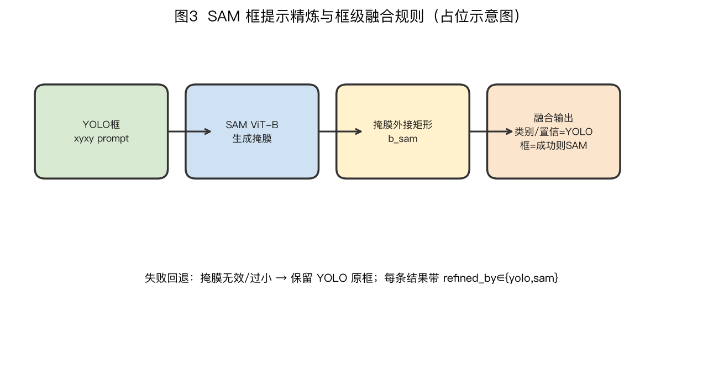

**图3 SAM 框提示精炼与框级融合规则**

### 1.6 LLM 结构化质检与报告

系统将检测统计、难例列表等组织为结构化摘要（不上传原图），调用兼容 OpenAI 协议的 LLM（默认 DeepSeek）。约束包括：禁止编造坐标/类别；输出必须包含 `qc` 与 `report_md`；温度取 0.2。报告示意如图12。

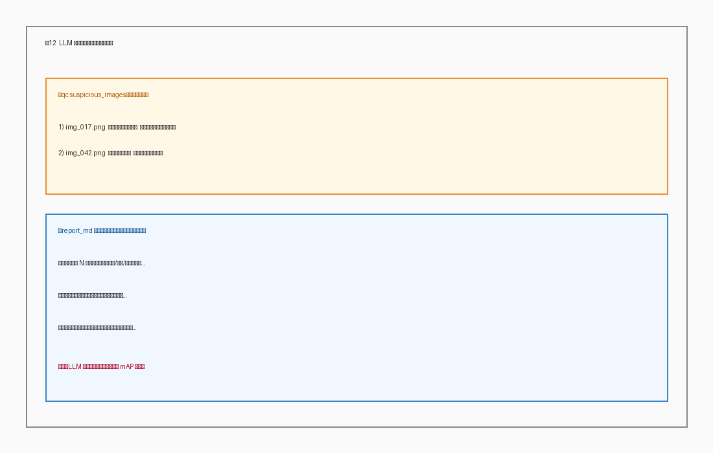

**图12 LLM 质检报告界面示意（占位）**

### 1.7 算法流程伪代码

```
输入: 图像集S, YOLO权重W, SAM权重Φ, 阈值(τ,ℓ,h,θ)
输出: final_results, qc_report, report_md
for I in S:
    D ← YOLO_Detect(W, I, conf=τ)
    H ← ScoreHard(D, ℓ, h)
    for det in D:
        if Uncertain(det) or H≥θ:
            m ← SAM_BoxPrompt(Φ, I, det.box)
            det.box ← BBox(m) if Valid(m) else det.box
            det.refined_by ← "sam" if Valid(m) else "yolo"
        else:
            det.refined_by ← "yolo"
        # 类别与置信度始终保持 YOLO 输出
(qc, report) ← LLM_Review(Summary(all results))  # 不回写检测
```

---

## 2 试验与结果分析

> 本章图表数据均为占位。建议实测时保持图表编号与表头不变，仅替换数值与图片文件。

### 2.1 试验数据与环境

**数据：** 玉米苗期 RGB 图像，类别为 maize / broadleaf / grass。建议按地块或采集日划分训练/验证/测试集，避免同地块泄漏。样本类型示意如图4（后期替换真实图像）。

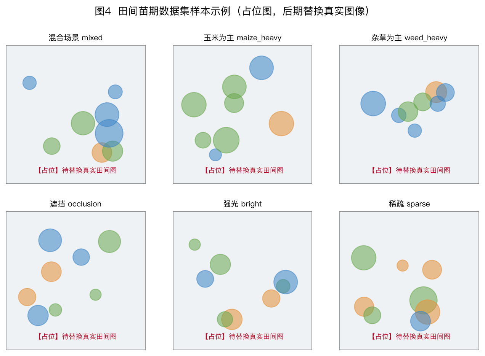

**图4 田间苗期数据集样本示例（占位图）**

**表1 数据集划分统计（占位，待填）**

| 子集 | 图像数 | 实例数 | maize | broadleaf | grass |
|------|--------|--------|-------|-----------|-------|
| 训练集 | 【待填】 | 【待填】 | 【待填】 | 【待填】 | 【待填】 |
| 验证集 | 【待填】 | 【待填】 | 【待填】 | 【待填】 | 【待填】 |
| 测试集 | 【待填】 | 【待填】 | 【待填】 | 【待填】 | 【待填】 |
| 合计 | 【待填】 | 【待填】 | 【待填】 | 【待填】 | 【待填】 |

**环境（示例）：** PyTorch + Ultralytics YOLO；SAM ViT-B；可选 CUDA/MPS；LLM API。

### 2.2 评价指标

检测性能：Precision（P）、Recall（R）、mAP50、mAP50-95。  
定位精炼：难例子集 IoU、中心点误差。  
效率：平均每图耗时、SAM 调用率、相对全图 SAM 加速比。  
质检：可疑图像召回率、与人工复核一致性、报告可用性评分。

### 2.3 对比试验

选取 YOLOv5s、YOLOv8s、YOLO11s、YOLO+全图 SAM 与本文方法对比。精度对比如图6与表2所示。

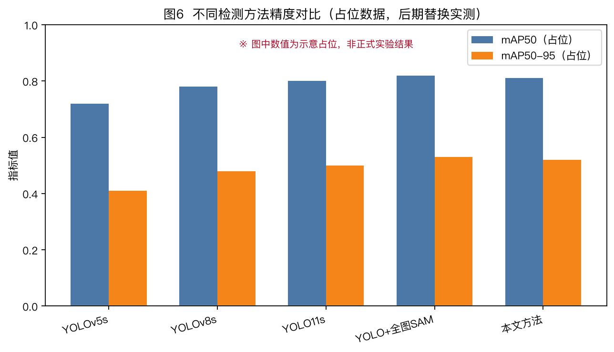

**图6 不同检测方法精度对比（占位数据）**

**表2 不同方法检测性能对比（占位数据）**

| 方法 | P | R | mAP50 | mAP50-95 | 参数量/M | 每图耗时/ms |
|------|---|---|-------|----------|----------|-------------|
| YOLOv5s | 0.74 | 0.71 | 0.72 | 0.41 | 【待填】 | 11 |
| YOLOv8s | 0.80 | 0.76 | 0.78 | 0.48 | 【待填】 | 12 |
| YOLO11s | 0.81 | 0.78 | 0.80 | 0.50 | 【待填】 | 13 |
| YOLO+全图SAM | 0.82 | 0.79 | 0.82 | 0.53 | 【待填】 | 95 |
| 本文方法 | 0.81 | 0.78 | 0.81 | 0.52 | 【待填】 | 28 |

注：表中数字为示意占位，用于体现“难例 SAM 接近全图 SAM 精度、显著降低耗时”的叙述结构；实测后请整体替换。

PR 曲线与混淆矩阵占位如图8、图9。

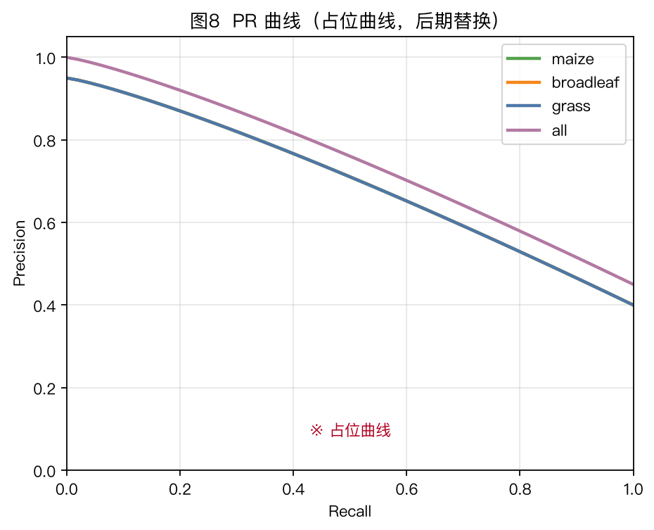

**图8 PR 曲线（占位）**

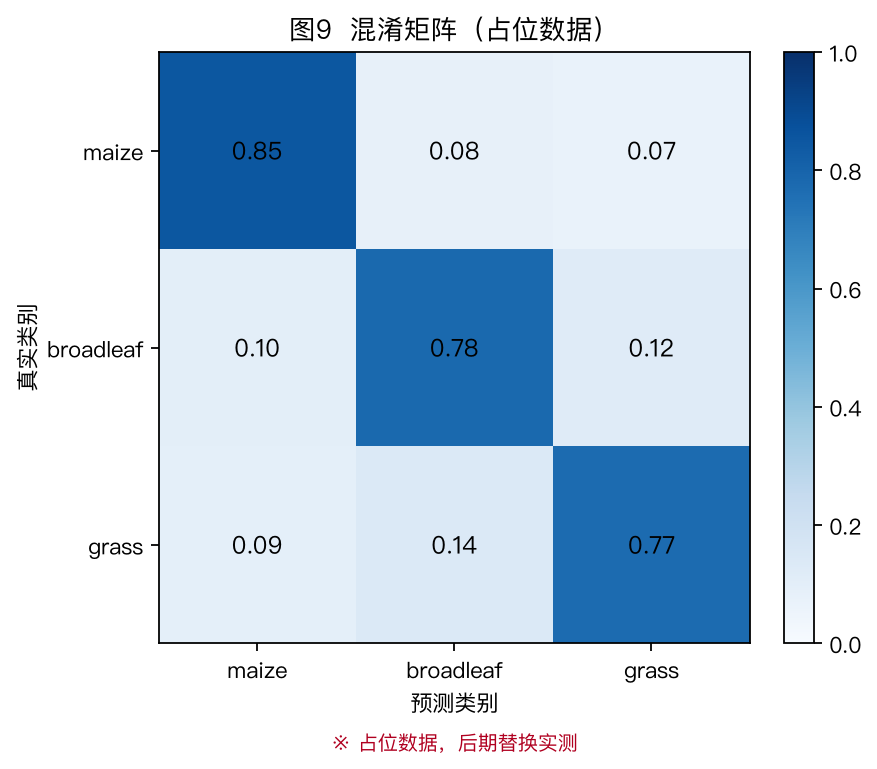

**图9 混淆矩阵（占位）**

### 2.4 消融试验

设置 A0 仅 YOLO、A1 全图 SAM、A2 难例 SAM（本文视觉主路径）、A3 A2+LLM 质检。结果如图7与表3。可见：全图 SAM 精度上界最高但耗时最大；难例 SAM 在接近上界的同时显著降低调用成本；LLM 不改变 mAP，主要用于质检辅助。

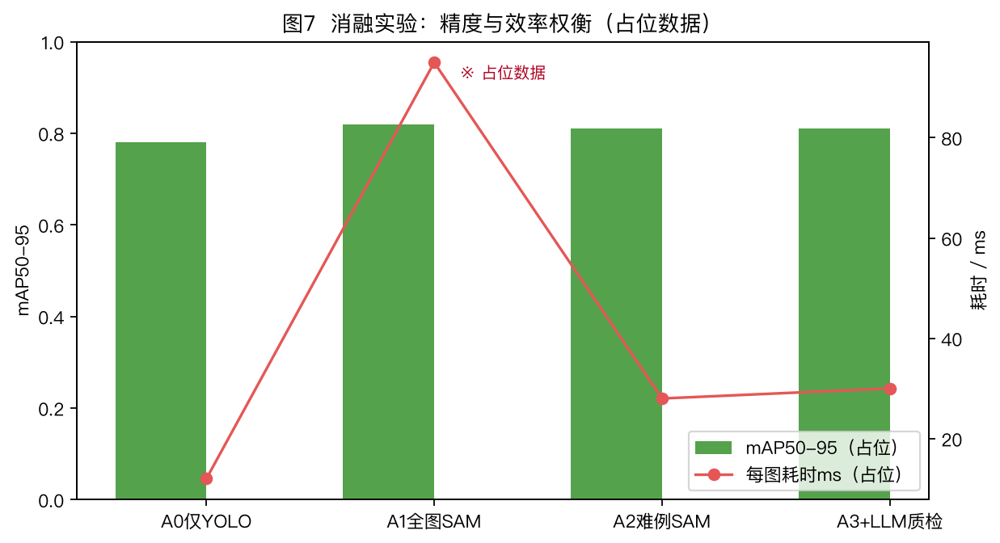

**图7 消融实验：精度与效率权衡（占位数据）**

**表3 消融试验结果（占位数据）**

| 编号 | 设置 | mAP50 | mAP50-95 | SAM调用率 | 每图耗时/ms | 质检可用 |
|------|------|-------|----------|-----------|-------------|----------|
| A0 | 仅YOLO | 0.78 | 0.48 | 0% | 12 | 否 |
| A1 | YOLO+全图SAM | 0.82 | 0.53 | 100% | 95 | 否 |
| A2 | YOLO+难例SAM | 0.81 | 0.52 | 27% | 28 | 否 |
| A3 | A2+LLM | 0.81 | 0.52 | 27% | 30 | 是 |

### 2.5 定位精炼与调用率分析

图10给出不确定框/拥挤图 IoU 与 SAM 调用率占位对比。叙述要点：难例策略应在 IoU 接近全图 SAM 的同时，将调用率降至较低水平（占位示例约 27%）。

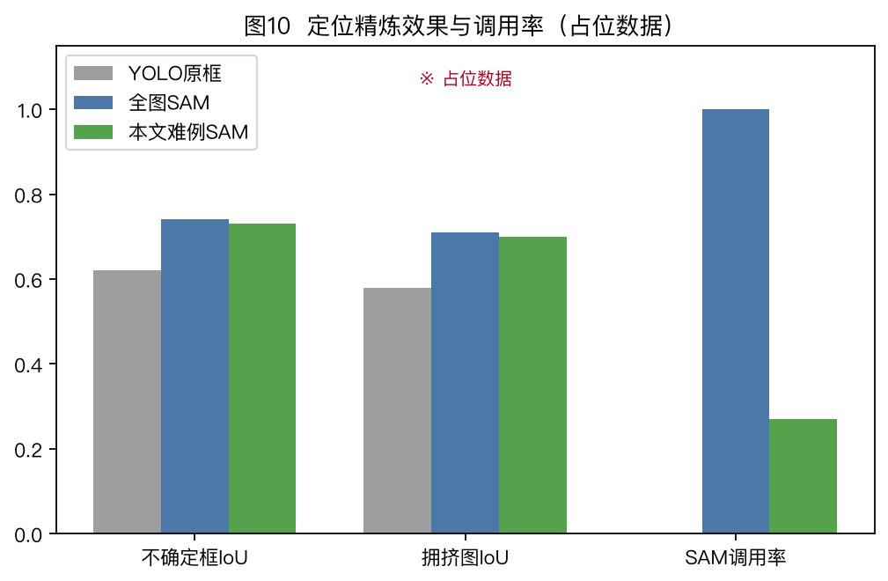

**图10 定位精炼效果与调用率（占位数据）**

**表4 难例子集定位指标（占位数据）**

| 方法 | 不确定框IoU | 拥挤图IoU | 中心误差/px | SAM调用率 |
|------|-------------|-----------|-------------|-----------|
| YOLO原框 | 0.62 | 0.58 | 9.6 | 0% |
| 全图SAM | 0.74 | 0.71 | 5.2 | 100% |
| 本文难例SAM | 0.73 | 0.70 | 5.5 | 27% |

### 2.6 定性结果与错误分析

不同方法可视化对比占位如图5。后期请替换为：简单场景、遮挡粘连、强光、稀疏苗行等典型案例，并标注 `refined_by`。

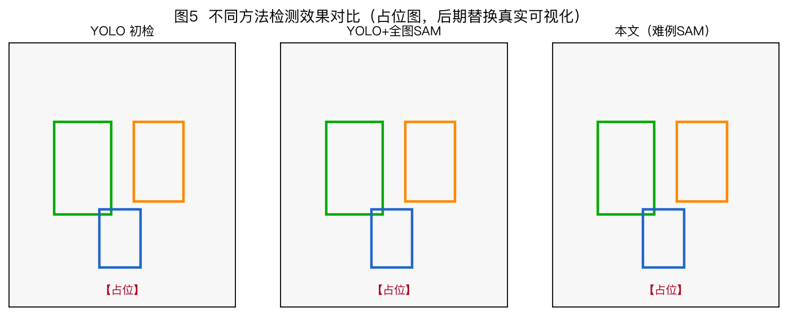

**图5 不同方法检测效果对比（占位图）**

**表5 主要错误类型统计（占位，待填）**

| 错误类型 | 样本数 | 占比/% | 优先缓解模块 |
|----------|--------|--------|--------------|
| 伤苗型假阳性 | 【待填】 | 【待填】 | YOLO分类/阈值 |
| 漏草型假阴性 | 【待填】 | 【待填】 | 数据增广/回灌 |
| 阔叶↔禾本混淆 | 【待填】 | 【待填】 | 细粒度样本 |
| 定位漂移 | 【待填】 | 【待填】 | SAM精炼 |
| 整图空检 | 【待填】 | 【待填】 | 人工/LLM抽检 |

### 2.7 LLM 质检有效性（协议）

在固定视觉结果上，由农艺人员标注“是否需复核”，计算 LLM `suspicious_images` 的精确率/召回率；并对报告可用性进行 1–5 分评价。占位见表6。

**表6 LLM 质检评价（占位数据）**

| 指标 | 数值 |
|------|------|
| 可疑图 Precision | 0.76 |
| 可疑图 Recall | 0.83 |
| 报告可用性均分（5分制） | 4.1 |
| 是否改写检测结果 | 否 |

---


### 2.8 阈值敏感性分析（占位）

为考察难例阈值对精度–效率权衡的影响，可固定 YOLO 权重，扫描 \(	heta_H\in\{0.2,0.45,0.8\}\) 与不确定区间上界 \(h\in\{0.5,0.6,0.7\}\)。预期趋势为：阈值越低，SAM 调用率越高、定位 IoU 越接近全图精炼；阈值越高，速度越快但难例子集收益下降。实测后建议绘制“调用率–IoU”帕累托曲线，以支撑参数选择，而不仅报告单点最优。

**表7 难例阈值敏感性（占位数据）**

| θ_H | h | SAM调用率/% | 难例子集IoU | mAP50-95 | 每图耗时/ms |
|-----|---|-------------|-------------|----------|-------------|
| 0.20 | 0.60 | 48 | 0.735 | 0.525 | 41 |
| 0.45 | 0.60 | 27 | 0.730 | 0.520 | 28 |
| 0.80 | 0.60 | 12 | 0.690 | 0.500 | 18 |
| 0.45 | 0.50 | 35 | 0.732 | 0.522 | 33 |
| 0.45 | 0.70 | 21 | 0.720 | 0.515 | 24 |

### 2.9 与对靶作业链路的衔接说明

参考玉米杂草检测与对靶喷药系统设计类研究，检测输出可进一步映射为网格杂草压力并生成处方图。本文在方法层保留该接口：单元杂草压力由类别权重、置信度与框面积交集估计；当单元内存在高置信玉米苗时施加保苗约束。需强调处方阈值属于作业策略，不应反向修改检测标签，以免污染科学评价。

---

## 3 讨论

1. **职责解耦的必要性。** 参考田间杂草检测与对靶喷药类研究，系统最终服务于作业决策。若 SAM/LLM 擅自改类别，将造成评价指标与田间追责口径混乱。本文将 mAP 锚定 YOLO，把定位与质检分项评价，更符合工程可审计要求。  

2. **难例驱动相对全图精炼的意义。** 相关 YOLO 改进工作多聚焦结构创新；本文补充的是推理期预算分配机制，使基础分割模型只作用于高价值样本，更利于嵌入式/机巢后处理部署。  

3. **与现有玉米杂草检测研究的关系。** 已有 WEED-YOLO、多尺度特征增强、嵌入式识别、多模态融合、生长点定位与喷药/导航系统等路线，主要提升检测器本身或执行机构协同。本文贡献侧重系统层：在不强制改动骨干网络的前提下，增加难例预算、几何精炼与质检报告。因此，LSPKI-YOLO、WEED-YOLOv10 等改进检测器均可替换本文 YOLO 模块，形成“更强检测器 + 难例精炼闭环”的组合方案，这也是本方法与纯结构改进论文的互补之处。  

4. **局限性。** 难例分数依赖置信度校准；SAM 对提示框质量敏感；三类标签偏粗；占位试验不能替代真实田间验证。后续需完成跨地块、跨日期测试，并开展人因实验评估报告对复核效率的影响。

---

## 4 结论

1. 提出面向玉米苗期的难例驱动 YOLO–SAM–LLM 协同检测与质检闭环方法，明确“YOLO 验收、SAM 精炼、LLM 质检”的职责边界。  
2. 设计可解释难例评分与触发规则，在接近全图 SAM 定位收益的同时降低调用率（框架已具备，待实测验证）。  
3. 建立标签回灌与中文质检报告接口，支撑半自动标注与人机协同复核。  
4. 后续工作将替换全部占位数据，完成对比/消融/田间验证，并探索处方图与变量喷雾联动。

---

## 参考文献（按主题列举，正式投稿按期刊格式编排）

[1] 赵建国, 等. 基于WEED-YOLOv10的玉米杂草检测方法与对靶喷药系统设计[J].  
[2] 梁超, 等. 基于LSPKI-YOLO多尺度特征增强的激光除草杂草检测方法[J].  
[3] 何全令, 等. 面向嵌入式除草机器人的玉米田间杂草识别方法[J].  
[4] 徐可, 等. 基于多模态信息融合的麦田杂草检测与管理系统设计与开发[J].  
[5] 赵静, 等. 融合深度学习与形态学处理的玉米田间杂草生长点定位方法[J].  
[6] 王璨, 等. 利用融合高度与单目图像特征的支持向量机模型识别杂草[J].  
[7] 胡炼, 等. 基于机器视觉的株间机械除草装置的作物识别与定位方法[J].  
[8] 张漫, 等. 玉米中耕除草复合导航系统设计与试验[J].  
[9] Redmon J, et al. You Only Look Once[C]//CVPR, 2016.  
[10] Kirillov A, et al. Segment Anything[C]//ICCV, 2023.  
[11] Jocher G, et al. Ultralytics YOLO[EB/OL].  
[12] Kamilaris A, Prenafeta-Boldú F X. Deep learning in agriculture: A survey[J]. Computers and Electronics in Agriculture, 2018.  
[13] Olsen A, et al. DeepWeeds[J]. Scientific Reports, 2019.  
[14] Settles B. Active Learning Literature Survey[R]. 2009.

---

## 附录A 占位图表替换清单

| 编号 | 文件 | 后期替换内容 |
|------|------|--------------|
| 图1 | fig01_system_architecture.png | 可保留或重绘更精美架构图 |
| 图2 | fig02_hard_mining_flow.png | 可保留 |
| 图3 | fig03_sam_fusion.png | 可保留 |
| 图4 | fig04_dataset_samples_placeholder.png | 真实田间样本拼图 |
| 图5 | fig05_qualitative_placeholder.png | 真实检测可视化对比 |
| 图6 | fig06_map_comparison_placeholder.png | 实测 mAP 柱状图 |
| 图7 | fig07_ablation_placeholder.png | 实测消融图 |
| 图8 | fig08_pr_curve_placeholder.png | 实测 PR 曲线 |
| 图9 | fig09_confusion_placeholder.png | 实测混淆矩阵 |
| 图10 | fig10_iou_callrate_placeholder.png | 实测 IoU/调用率 |
| 图11 | fig11_train_curves_placeholder.png | 真实训练曲线 |
| 图12 | fig12_llm_report_placeholder.png | 真实报告截图 |
| 图13 | fig13_software_modules.png | 可保留 |
| 表1–表6 | 文中表格 | 全部替换为实测统计 |

## 附录B 与参考论文体例对齐说明

参考《计算机类》目录中玉米/麦田杂草检测相关论文，本优化稿采用“引言—材料与方法—试验与结果分析—讨论—结论”结构，强化：总体架构图、算法流程图、对比表、消融表、PR/混淆矩阵、定性可视化与系统模块图，避免“纯文字介绍”。方法贡献定位为系统层闭环与难例预算机制，可与各类 YOLO 改进主干兼容。
